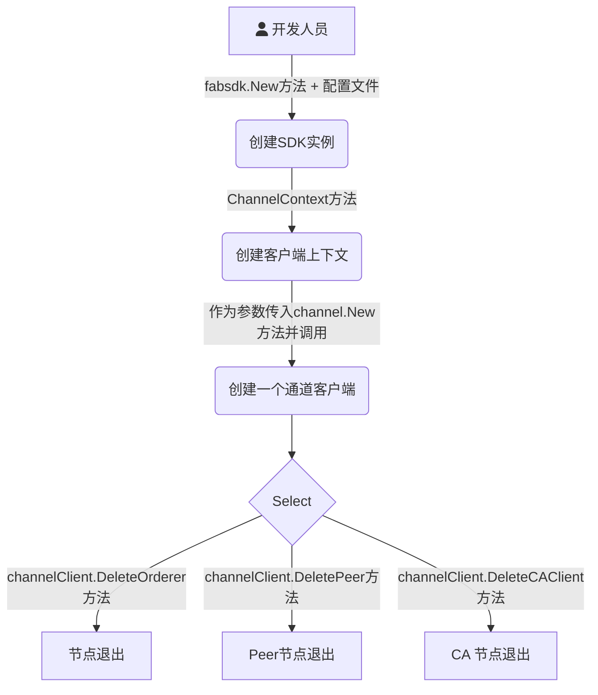

```mermaid
graph TD
    A[fa:fa-user 开发人员] -->|fabsdk.New方法 + 配置文件| B(创建SDK实例)
    B-->|ChannelContext方法| C(创建客户端上下文)
    C-->|作为参数传入channel.New方法并调用| D(创建一个通道客户端)
    D --> E{Select}
    E -->|channelClient.DeleteOrderer方法| F[fa:fa-Orderer节点退出]
    E -->|channelClient.DeletePeer方法| G[Peer节点退出]
    E -->|channelClient.DeleteCAClient方法| H[CA 节点退出]
  
```