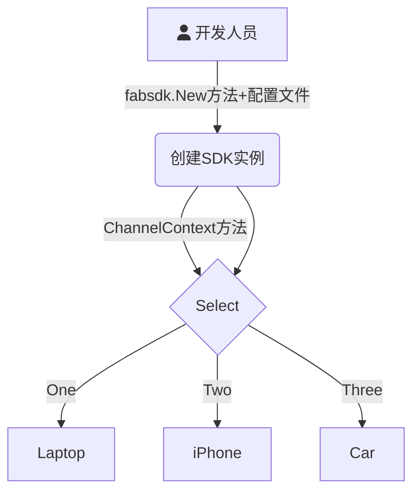

```mermaid
graph TD
    A[fa:fa-user 开发人员] -->|fabsdk.New方法+配置文件| B(创建SDK实例)
    B-->|ChannelContext方法| C(创建了客户端上下文)
    B --> C{Select}
    C -->|One| D[Laptop]
    C -->|Two| E[iPhone]
    C -->|Three| F[Car]
  
```